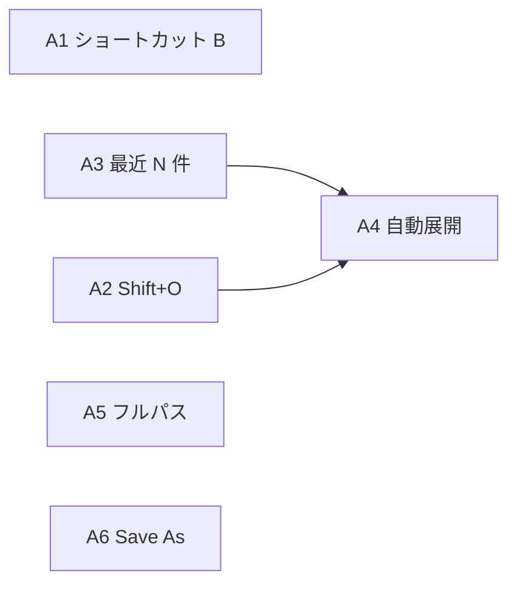

# Karasu 設計判断の記録

このドキュメントは、Karasu が **なぜ今の形になっているか** を他の開発者に伝えるためのものです。  
機能一覧だけでなく、検討した候補・採用しなかった案・トレードオフを残します。

初期の要件定義は [`superpowers/specs/2026-06-03-tauri-markdown-viewer-design.md`](superpowers/specs/2026-06-03-tauri-markdown-viewer-design.md) を参照してください。本書はその後の実装で追加・変更した部分を中心に説明します。

拡張案の評価表・実装フェーズ・却下理由の一覧は [機能バックログ（提案一覧）](#機能バックログ提案一覧) を参照。

---

## 設計で最優先していること

Karasu の価値は「Markdown を軽く編集・閲覧する」ことです。性能や依存の議論では次の順で判断しています。

| 優先度 | 観点               | 意味                                                           |
| ------ | ------------------ | -------------------------------------------------------------- |
| 1      | **起動中の CPU**   | 編集中・待機中にメインスレッドや WebView が忙しくならないこと  |
| 2      | **起動中のメモリ** | 常駐する文法・WASM・巨大ツリー・全フォント読み込みを避けること |
| 3      | **GPU / 描画**     | 不要な DOM や再描画でスクロールが重くならないこと              |
| 4      | **I/O**            | 起動や操作のたびにディスク・ネットワークを叩きすぎないこと     |
| 5      | **ビルドサイズ**   | 配布物の KB は参考程度（軽さの主戦場ではない）                 |

「ビルドが小さい＝ランタイムが軽い」ではない（例: Shiki はビルドもランタイムも重くなりやすい）。

---

## アーキテクチャ概要

```
┌─────────────────────────────────────────────────────────┐
│  WebView（フロント: TypeScript + CSS）                    │
│  ├ ツールバー（開く / 別名で保存 / 一覧 / プレビュー / 設定） │
│  ├ サイドバー（任意表示）… ファイルツリー                  │
│  ├ エディタ（textarea）                                   │
│  └ プレビュー（marked → HTML、sugar-high はコードのみ）    │
└───────────────────────────┬───────────────────────────────┘
                            │ Tauri invoke（必要時のみ）
┌───────────────────────────▼───────────────────────────────┐
│  Rust                                                     │
│  ├ read_file / write_file                                 │
│  ├ get_recent_path / get_recent_paths（MRU、最大 10 件）   │
│  ├ get/set_workspace_root（作業フォルダ）                  │
│  ├ list_directory（1 階層ずつ）                            │
│  ├ search_filenames（作業フォルダ内ファイル名検索）        │
│  ├ set_workspace_watch（notify、設定 ON 時のみ）           │
│  └ list_system_fonts（設定画面用）                         │
└───────────────────────────────────────────────────────────┘
```

**意図**: 重い処理は Rust に寄せつつ、**編集ループはフロントのテキストと CSS だけ**で回す。プレビュー HTML 生成は「プレビューに切り替えたとき」に限定する。

---

## 技術スタック

| 層                   | 採用                             | 候補・却下                                   | 理由                                                                               |
| -------------------- | -------------------------------- | -------------------------------------------- | ---------------------------------------------------------------------------------- |
| デスクトップ         | **Tauri 2**                      | Electron                                     | ネイティブ WebView でメモリ・起動が比較的軽い。Markdown ビューワー程度の要件に十分 |
| フロント             | **Vite + TypeScript（Vanilla）** | React / Vue                                  | 状態が単純。フレームワーク常駐コストを避ける                                       |
| Markdown             | **marked（GFM）**                | micromark + 拡張の自作、unified パイプライン | 実装コストとバンドルのバランス。プレビュー用途なら十分                             |
| ネイティブダイアログ | **tauri-plugin-dialog**          | Rust `rfd` のみ                              | JS から「開く」操作と統合しやすい。常時ポーリングはしない                          |
| Rust プラグイン      | **dialog + opener**              | fs / shell / 多数プラグイン                  | 外部リンクはプレビュー時のみ。ファイル I/O は自前コマンド                          |

---

## 画面構成と UX

### 編集とプレビューは「切り替え」、常時 2 ペインではない

| 候補                                      | 採用     | 理由                                                                                                        |
| ----------------------------------------- | -------- | ----------------------------------------------------------------------------------------------------------- |
| 左右分割（エディタ + プレビュー常時表示） | 却下     | DOM とプレビュー更新が常に走り、GPU・CPU 負荷が増える。初期設計の「複数ペインの常時表示は含めない」にも合致 |
| **1 画面で編集 ↔ プレビュー切替**         | **採用** | `Cmd/Ctrl+P`。プレビューは必要時だけ `marked` + ハイライト                                                  |

### 保存は明示のみ

| 候補                                   | 採用     | 理由                                                    |
| -------------------------------------- | -------- | ------------------------------------------------------- |
| 自動保存                               | 却下     | 意図しない上書きを避ける。設計書どおり                  |
| **`Cmd/Ctrl+S`（上書き）+ 別名で保存** | **採用** | 保存状態を「保存済み / 未保存」で明示。自動保存はしない |

### プレビューの見た目（DADS 風）

| 候補                                       | 採用                | 理由                                                                                                           |
| ------------------------------------------ | ------------------- | -------------------------------------------------------------------------------------------------------------- |
| エディタと同じダークテーマ                 | 却下（プレビュー）  | 長文の読みやすさのためプレビューは常にライト背景                                                               |
| **デジタル庁 DADS 系のタイポ**（参考 CSS） | **採用**            | 見出し階層・行間・コードブロック（ダーク）を文書向けに整理。VS Code の Markdown プレビュー用テーマを参考にした |
| Google Fonts（Noto）                       | 一度導入後 **削除** | オンライン I/O と常駐フォントキャッシュを避け、システムフォント方針に統一                                      |

---

## ファイル一覧（サイドバー）

### 用語

| 使わない用語           | 使う用語         | 理由                                       |
| ---------------------- | ---------------- | ------------------------------------------ |
| Vault（Obsidian 固有） | **作業フォルダ** | 一般向けの説明とし、ツール固有の語を避ける |

### 機能の候補と採用

| 候補                                             | 採用                                  | 理由                                                                                            |
| ------------------------------------------------ | ------------------------------------- | ----------------------------------------------------------------------------------------------- |
| 毎回「開く」ダイアログだけ                       | 併用                                  | 単発で開く用途は残す                                                                            |
| **作業フォルダ + サイドバー**                    | **採用**                              | 多数の Markdown を行き来する苦痛を解消。Obsidian / VS Code の「Explorer」に近いが、機能は最小限 |
| 起動時に全ファイル再帰スキャン                   | 却下                                  | 巨大フォルダで I/O・CPU スパイク。`node_modules` 等で破綻しやすい                               |
| **`list_directory` で 1 階層ずつ（遅延ツリー）** | **採用**                              | フォルダを開いたときだけ Rust が読む。メモリ・I/O を抑える                                      |
| `notify` による常時監視                          | **オプション**（設定で ON、既定 OFF） | 待機中負荷を避けるため既定は手動 **↻**。ON 時は 300ms デバウンス後にツリー更新                  |
| サイドバー常時表示                               | 却下                                  | 執筆領域を狭める。ツールバー **「一覧」** で開閉（既定は非表示）                                |
| 最近ファイル MRU・フォルダ内検索・新規作成       | **採用**                              | サイドバー上部の最近リスト、検索ボタン、`write_file` による新規（A3・B2・B5）                   |
| 仮想スクロール                                   | 未実装（D1）                          | 現状は展開分だけ DOM。件数が問題になったら検討                                                  |

### 除外ルール（`src-tauri/src/dir.rs`）

- ディレクトリ: `.git`, `node_modules`, `target`, `dist` など
- ファイル: `.md`, `.markdown`, `.mdown`, `.mkd`, `.txt` のみ表示
- ドットファイルはディレクトリごとスキップ（`.` 以外）

### ファイル切り替え時

未保存のまま別ファイルを開く場合は **`window.confirm`** で破棄確認（自動保存はしないため必須）。

### 永続化

| データ             | 保存先                                   |
| ------------------ | ---------------------------------------- |
| 作業フォルダのパス | Rust `app_data_dir/workspace.json`       |
| サイドバー開閉     | `localStorage` `karasu-sidebar-visible`  |
| 直近開いたファイル | Rust `recent.json`（最大 10 件の MRU）   |
| スクロール位置     | `localStorage` `karasu-scroll-positions` |

---

## 表示設定（フォント・サイズ）

### なぜ Web だけではフォントを列挙できないか

ブラウザ / WebView は **OS にインストールされたフォント名の一覧を標準 API では返しません**。  
そのため初期実装では「よくあるフォント名」のプリセットだけを用意していました。

### 現在の方式

| 候補                                              | 採用                     | 理由                                                                                    |
| ------------------------------------------------- | ------------------------ | --------------------------------------------------------------------------------------- |
| 固定プリセットのみ                                | フォールバックとして残す | Tauri 外の `vite` 単体開発時用                                                          |
| **Rust `fontdb` でシステムフォント列挙**          | **採用**                 | 実際に入っているフォントだけを設定に出す。設定モーダルを開いたとき（＋起動後 BG）に取得 |
| フォント変更のたび Web Font 読み込み              | 却下                     | I/O とメモリ。採用しない                                                                |
| **CSS 変数で `font-family` / `font-size` を切替** | **採用**                 | Markdown の再パース不要。ランタイムコストは変更時の 1 回レイアウト程度                  |
| 設定 UI をツールバー下に常時表示                  | 却下                     | 画面を圧迫                                                                              |
| **設定はモーダル**                                | **採用**                 | 必要なときだけ                                                                          |
| **エディタ常時ライト（オプション）**              | **採用**（C3）           | `:root.editor-light` でダーク OS でも編集面をライト固定。既定 OFF                       |
| **作業フォルダのファイル監視（オプション）**      | **採用**（B1）           | `notify` + 300ms デバウンス。設定で ON、**既定 OFF**                                    |

編集用リストは等幅フォントを中心に、プレビューは非等幅を中心に UI で分けています（`src/settings.ts`）。表示設定は `localStorage` の `karasu-display-settings` に保存。

---

## シンタックスハイライト

詳細は [`syntax-highlighting.md`](syntax-highlighting.md) に記載。

**要約**: ランタイム負荷を抑えるため **sugar-high** を採用。Shiki は品質は高いが WASM・文法の常駐で本プロジェクトの優先順位と合わない。ハイライトはプレビュー切替時のみ。同一内容の再プレビューはキャッシュ。

---

## Tauri 設定を極限まで削らない理由

`core:default` や `dialog:default` のまま、Cargo の `tauri` feature も広めに残しています。

| 検討                              | 結論                                                                  |
| --------------------------------- | --------------------------------------------------------------------- |
| capabilities を最小権限だけに削る | 可能だが **体感性能はほぼ変わらない**（主にバイナリと ACL）           |
| WebView をやめる                  | プレビュー HTML のため現実的でない                                    |
| **現状維持**                      | **開発コスト対効果**が小さい。ボトルネックは WebView とプレビュー DOM |

将来、配布サイズや攻撃面を詰めるフェーズで見直す余地はあります。

---

## 初期設計書からのスコープ変更

| 初期設計               | 現在                                     | 備考                                                                                  |
| ---------------------- | ---------------------------------------- | ------------------------------------------------------------------------------------- |
| ノート管理は含めない   | サイドバーで **ファイル切り替え** を追加 | タグ・検索・バックリンク・DB 化はしていない。パス一覧＋遅延ツリーのみ                 |
| 複数ペイン常時表示なし | 同上（プレビューは切替）                 | 変更なし                                                                              |
| 軽量優先               | 同上を維持した拡張                       | 遅延ツリー・MRU・オプション監視・プレビュー時ハイライト。バックログ A〜C 群は実装済み |

---

## キーボードショートカット

| 操作                         | ショートカット     |
| ---------------------------- | ------------------ |
| 保存                         | `Cmd/Ctrl+S`       |
| 別名で保存                   | `Cmd/Ctrl+Shift+S` |
| ファイルを開く（ダイアログ） | `Cmd/Ctrl+O`       |
| 作業フォルダを開く           | `Cmd/Ctrl+Shift+O` |
| 編集 ↔ プレビュー            | `Cmd/Ctrl+P`       |
| サイドバー（一覧）の開閉     | `Cmd/Ctrl+B`       |

---

## ソースとドキュメントの対応

| 領域                  | 主なファイル                      |
| --------------------- | --------------------------------- |
| アプリ入口            | `src/main.ts`                     |
| Markdown + ハイライト | `src/markdown.ts`                 |
| サイドバー            | `src/sidebar.ts`                  |
| サイドバー開閉        | `src/sidebar-layout.ts`           |
| 表示設定              | `src/settings.ts`, `src/fonts.ts` |
| スクロール記憶        | `src/session-state.ts`            |
| スタイル              | `src/styles.css`                  |
| Rust コマンド         | `src-tauri/src/commands.rs`       |
| ディレクトリ列挙      | `src-tauri/src/dir.rs`            |
| ファイル名検索        | `src-tauri/src/search.rs`         |
| ファイル監視          | `src-tauri/src/watch.rs`          |
| 作業フォルダ永続化    | `src-tauri/src/workspace.rs`      |
| 直近ファイル          | `src-tauri/src/recent.rs`         |
| フォント列挙          | `src-tauri/src/fonts.rs`          |

---

## 関連ドキュメント

| ドキュメント                                                               | 内容                                   |
| -------------------------------------------------------------------------- | -------------------------------------- |
| [初期設計書](superpowers/specs/2026-06-03-tauri-markdown-viewer-design.md) | プロジェクト起源の要件・スコープ       |
| [シンタックスハイライト選定](syntax-highlighting.md)                       | sugar-high / Shiki 等の比較            |
| [README](../README.md)                                                     | 使い方・開発コマンド                   |
| [機能バックログ（本書内）](#機能バックログ提案一覧)                        | 拡張案 A〜E の評価・フェーズ・却下記録 |

---

## 機能バックログ（提案一覧） {#機能バックログ提案一覧}

2026-06 時点で検討した拡張案の一覧。**A1〜C4（A・B・C 群、計 15 ID）は実装済み**（2026-06）。**D 群は未実装**、**E 群は却下記録**。  
採用・却下・実装のたびに、下表の **ステータス** を更新する。

| 群  | ID 数       | ステータス   |
| --- | ----------- | ------------ |
| A   | 6（A1〜A6） | 実装済み     |
| B   | 5（B1〜B5） | 実装済み     |
| C   | 4（C1〜C4） | 実装済み     |
| D   | 4（D1〜D4） | 提案         |
| E   | 7（E1〜E7） | 却下（記録） |

### バックログの位置づけ

| 観点   | 説明                                                                                                  |
| ------ | ----------------------------------------------------------------------------------------------------- |
| 目的   | 多数ファイルの切り替え・日常操作の改善を、**軽量方針を壊さない範囲**で進める                          |
| 非目的 | Obsidian / VS Code の全機能再現、ノート DB、Git UI、WYSIWYG                                           |
| 評価軸 | [設計で最優先していること](#設計で最優先していること) の順（CPU → メモリ → GPU → I/O → ビルドサイズ） |

### 現状のボトルネック（比較の基準）

拡張案を評価するときは、次を「すでにかかっているコスト」として意識する。

| 要因                      | 待機中             | スパイクが出る操作                 | 備考                             |
| ------------------------- | ------------------ | ---------------------------------- | -------------------------------- |
| **WKWebView**             | メモリ・GPU の大半 | プレビュー HTML の描画・スクロール | 回避不可（プレビュー方針の前提） |
| **`marked` + sugar-high** | 影響なし           | プレビュー切替時（キャッシュあり） | 編集中はゼロ                     |
| **`fontdb` 列挙**         | 影響なし           | 設定モーダル初回・起動後 BG 1 回   | 常駐しない                       |
| **サイドバー遅延ツリー**  | 影響なし           | フォルダ展開・↻ 再読み込み         | 展開分だけ DOM                   |
| **明示保存・`read_file`** | 影響なし           | ファイルを開く・保存したとき       | 既存コア                         |

バックログの多くは **この上に乗る追加分** であり、◎〜○なら「採用しても芯の軽さは保ちやすい」という意味になる。

---

### 評価記号の読み方

#### ランタイム影響（5 段階）

| 記号       | 意味                     | 待機中の目安                         |
| ---------- | ------------------------ | ------------------------------------ |
| **◎ なし** | 誤差レベル               | バックグラウンド処理なし             |
| **○ 極小** | 設定値・文字列程度の常駐 | KB 単位                              |
| **△ 小**   | 操作時のみ軽い負荷       | クリック・ショートカット 1 回        |
| **▲ 中**   | データ規模で体感しうる   | 深いツリー・大きい walk              |
| **× 大**   | 常駐 or 巨大データ       | 監視 ON・全 repo 走査・常時 2 ペイン |

表では **常時 CPU / 常時メモリ / 操作時（CPU・レイアウト）/ I/O / GPU・DOM** を分けて記載する。

#### 実装難度（1〜5）

| 難度  | 目安（1 人） | 典型                                            |
| ----- | ------------ | ----------------------------------------------- |
| **1** | 半日以内     | 既存 TS/CSS の延長、ショートカット追加          |
| **2** | 0.5〜1 日    | Rust コマンド 1 本 + フロント接続               |
| **3** | 2〜3 日      | `notify`、walk 検索、Worker 化                  |
| **4** | 3〜5 日      | 仮想スクロール、大規模ツリー                    |
| **5** | 1 週間〜     | 製品の芯が変わる（Git UI、WYSIWYG、プラグイン） |

#### 想定工数

表の **工数** 列は実装・手動確認・ドキュメント追記を含む **ざっくり** 見積もり。並行や既存コードへの精通で前後する。

#### ステータス（実装時に更新）

| ステータス | 意味                           |
| ---------- | ------------------------------ |
| `提案`     | 本書記載時点。未着手           |
| `採用`     | 実装予定確定                   |
| `実装済み` | マージ済み。該当節へ移動推奨   |
| `却下`     | 方針不合。E 節へ理由付きで移動 |

**A1〜C4**: `実装済み`。**D1〜D4**: `提案`。**E1〜E7**: `却下`（記録のみ）。

---

### A. いちばんおすすめ（軽量・効果大）

サイドバー導入後の **いちばんの痛み**（ショートカット・履歴・パス表示・保存まわり）に直結する案。

| ID     | 機能                                 | ステータス | 詳細                                                                                                 | 常時 CPU | 常時メモリ     | 操作時       | I/O            | GPU/DOM                 | 難度 | 工数    | 主な変更箇所                   |
| ------ | ------------------------------------ | ---------- | ---------------------------------------------------------------------------------------------------- | -------- | -------------- | ------------ | -------------- | ----------------------- | ---- | ------- | ------------------------------ |
| **A1** | サイドバー `Cmd/Ctrl+B`              | 実装済み   | 一覧の開閉。`aria-expanded` 同期。VS Code / Obsidian 慣習に合わせる                                  | ◎        | ◎              | ◎            | ◎              | ○ 非表示時も DOM は残る | 1    | 0.5h    | `sidebar-layout.ts`, `main.ts` |
| **A2** | 作業フォルダ `Cmd/Ctrl+Shift+O`      | 実装済み   | 単一ファイル `Cmd/Ctrl+O` と分離。`open({ directory: true })`                                        | ◎        | ◎              | ◎            | △ ダイアログ時 | ◎                       | 1    | 0.5h    | `main.ts`, `sidebar.ts`        |
| **A3** | 最近開いたファイル（複数）           | 実装済み   | `recent.json` を配列（例: 最大 10 件）。サイドバー上部リスト or ドロップダウン。MRU                  | ◎        | ○ パス文字列   | ○ リスト描画 | △ 読込・追記   | ○ 数十行 DOM            | 2    | 0.5〜1d | `recent.rs`, `sidebar.ts`      |
| **A4** | 開いているファイルまでツリー自動展開 | 実装済み   | オープン時に親ディレクトリを `expanded` へ。各階層で `list_directory`（深さ d なら最大 d 回 invoke） | ◎        | ○ 展開状態 Set | △ 深さに比例 | △ 階層のみ     | △ 部分再描画            | 2    | 1d      | `sidebar.ts`                   |
| **A5** | フルパス表示                         | 実装済み   | ツールバーはファイル名のまま。ステータスバーに省略パス + `title` でフルパス。同名ファイル対策        | ◎        | ◎              | ◎            | ◎              | ◎                       | 1    | 1〜2h   | `main.ts`, `index.html`, CSS   |
| **A6** | 別名で保存（Save As）                | 実装済み   | `dialog` save → `write_file` → `state.path` 更新。新規作成に近いフローにも流用可                     | ◎        | ◎              | ○            | △ 保存時       | ◎                       | 2    | 0.5〜1d | `main.ts`, ツールバー          |

**A 群の依存関係**



- **A3・A2** があると **A4** の効果が体感として大きい（作業フォルダ＋履歴から開いた直後にツリーで迷子になりにくい）。

---

### B. あると便利（中コスト）

日常体験を一段上げるが、**設定・データ規模・依存** の検討が必要な案。

| ID     | 機能                         | ステータス | 詳細                                                                                                 | 常時 CPU   | 常時メモリ       | 操作時       | I/O              | GPU/DOM       | 難度 | 工数    | 主な変更箇所                  |
| ------ | ---------------------------- | ---------- | ---------------------------------------------------------------------------------------------------- | ---------- | ---------------- | ------------ | ---------------- | ------------- | ---- | ------- | ----------------------------- |
| **B1** | ファイル監視（オプション）   | 実装済み   | `notify` で作業フォルダを監視。既定 OFF。ON 時は変更でツリー無効化 or 部分更新。↻ と併用             | △〜▲ ON 時 | ○                | △ イベント毎 | ▲ 大量保存で洪水 | △ 再描画      | 3    | 2〜3d   | 新 Rust モジュール、設定      |
| **B2** | 作業フォルダ内ファイル名検索 | 実装済み   | ボタン実行時のみ Rust でファイル名 walk。`node_modules` 等除外。内容 grep は別機能                   | ◎          | ○ 結果キャッシュ | ▲ 大 repo    | ▲ 走査時         | △ 結果リスト  | 3    | 2〜3d   | `commands.rs`, UI             |
| **B3** | プレビュー外部リンク         | 実装済み   | `<a href="http...">` クリックで OS ブラウザ。`tauri-plugin-opener` + `preventDefault` + http(s) のみ | ◎          | ◎                | ◎            | ◎                | ◎             | 2    | 0.5〜1d | `main.ts`, `markdown.ts`      |
| **B4** | スクロール位置の記憶         | 実装済み   | パス → `scrollTop` を `localStorage` `karasu-scroll-positions`。`read_file` 後に復元                 | ◎          | ○ N ファイル分   | ◎            | △ 読書           | ◎             | 2    | 0.5〜1d | `session-state.ts`, `main.ts` |
| **B5** | 新規ファイル作成             | 実装済み   | ダイアログ or プロンプトで名前 → 空ファイル `write` → 即オープン。作業フォルダ必須                   | ◎          | ◎                | ○            | △ 1 ファイル     | ○ ツリー 1 行 | 2    | 1d      | Rust + `sidebar.ts`           |

**B1 のトレードオフ（詳細）**

| 方式                                      | メリット         | デメリット                 |
| ----------------------------------------- | ---------------- | -------------------------- |
| 常時 OFF・手動 ↻ のみ（**既定**）         | 待機コストゼロ   | 外部編集に気づかない       |
| 監視 ON（デバウンス 300ms、**実装済み**） | 体感が現代的     | 巨大 repo で CPU・I/O      |
| 監視 ON・作業フォルダ直下のみ             | 負荷上限しやすい | サブフォルダ変更は見えない |

---

### C. UX の磨き（小さく効く）

単体では小さいが、**滞在時間のストレス** を減らす案。

| ID     | 機能                               | ステータス | 詳細                                                                           | 常時 CPU | 常時メモリ | 操作時               | I/O | GPU/DOM | 難度 | 工数    | 主な変更箇所       |
| ------ | ---------------------------------- | ---------- | ------------------------------------------------------------------------------ | -------- | ---------- | -------------------- | --- | ------- | ---- | ------- | ------------------ |
| **C1** | 未保存をウィンドウタイトルに       | 実装済み   | `• filename - Karasu`。`getCurrentWebviewWindow().setTitle`                    | ◎        | ◎          | ◎                    | ◎   | ◎       | 1〜2 | 1〜3h   | `main.ts`          |
| **C2** | プレビュー→編集でフォーカス維持    | 実装済み   | 切替前に `selectionStart/End` 保存。`Cmd/Ctrl+P` 往復の断絶感を減らす          | ◎        | ◎          | ◎                    | ◎   | ◎       | 1    | 1〜2h   | `main.ts`          |
| **C3** | エディタもライト固定（オプション） | 実装済み   | 設定で「エディタを常にライト」。プレビューと同様の読みやすさ優先。CSS 変数のみ | ◎        | ◎          | ◎                    | ◎   | ◎       | 1    | 2〜4h   | `settings.ts`, CSS |
| **C4** | フロントマター非表示（プレビュー） | 実装済み   | 先頭 YAML `---` … `---` を strip してから `marked`。編集バッファは原文維持     | ◎        | ◎          | △ プレビュー時 regex | ◎   | ◎       | 2    | 0.5〜1d | `markdown.ts`      |

---

### D. スケール・インフラ寄り（問題が出てからでよい）

[`将来検討`](#機能バックログ提案一覧) として既に挙がっていた項目を、評価表に統合したもの。

| ID     | 機能                      | ステータス | 詳細                                                                        | 常時 CPU | 常時メモリ | 操作時                | I/O | GPU/DOM           | 難度 | 工数  | 主な変更箇所                  |
| ------ | ------------------------- | ---------- | --------------------------------------------------------------------------- | -------- | ---------- | --------------------- | --- | ----------------- | ---- | ----- | ----------------------------- |
| **D1** | サイドバー仮想スクロール  | 提案       | 展開ノードが数千超えたとき viewport 分だけ DOM。Obsidian 級の巨大ツリー向け | ◎        | ○          | △ スクロール計算      | ◎   | **改善** DOM 削減 | 4    | 3〜5d | `sidebar.ts` 全面             |
| **D2** | 巨大 MD のプレビュー制限  | 提案       | 例: 512KB 超で警告、1MB 超でプレビュー不可 or ハイライトのみスキップ        | ◎        | ◎          | **改善** スパイク抑制 | ◎   | **改善**          | 2    | 1d    | `markdown.ts`, UI             |
| **D3** | ハイライト Worker 化      | 提案       | `sugar-high` を Web Worker へ。巨大コードブロックで UI 固まり防止           | ○        | ○ Worker   | △ 転送                | ◎   | ◎                 | 3    | 2d    | `markdown.ts`                 |
| **D4** | Tauri capabilities 最小化 | 提案       | `removeUnusedCommands`、権限の細分化。体感性能より配布サイズ・ACL           | ◎        | やや改善   | ◎                     | ◎   | ◎                 | 2    | 1d    | `capabilities/`, `Cargo.toml` |

**D1 を検討するトリガー**

| 条件                                                     | 例                     |
| -------------------------------------------------------- | ---------------------- |
| 展開済み DOM ノードが **> 2,000** でスクロールがカクつく | フラットな巨大フォルダ |
| プロファイルで再描画が **> 16ms** が連続                 | Performance 計測       |

---

### E. 非推奨・スコープ外（比較・却下理由の記録）

採用しない案も **なぜ捨てたか** を残す。再議論のコストを下げるため。

| ID     | 機能                             | 却下理由（要約）                                                                | 常時影響 | 難度 | Karasu との相性 |
| ------ | -------------------------------- | ------------------------------------------------------------------------------- | -------- | ---- | --------------- |
| **E1** | 常時 2 ペイン（編集+プレビュー） | プレビュー DOM・更新が常時。設計書「複数ペイン常時表示なし」                    | ×        | 3    | 悪い            |
| **E2** | デフォルト自動保存               | 「明示保存」が芯。誤上書きリスク                                                | ○〜△     | 2〜3 | 方針と矛盾      |
| **E3** | Git 連携（差分・コミット UI）    | 別製品級の常駐・UI                                                              | ×        | 5    | スコープ外      |
| **E4** | バックリンク / グラフ / タグ DB  | ノート管理。索引・グラフ構築が重い                                              | ×        | 5    | スコープ外      |
| **E5** | WYSIWYG エディタ                 | エディタ全面差し替え                                                            | ×        | 5    | スコープ外      |
| **E6** | プラグイン機構                   | 依存・API 表面の爆発                                                            | ▲〜×     | 5    | 軽量と矛盾      |
| **E7** | Shiki への乗換                   | 品質↑ ランタイム↓。既に [syntax-highlighting.md](syntax-highlighting.md) で却下 | ×        | 3    | 決定済み        |

**E2 を将来許容する場合の条件（参考）**

| 要件       | 例                                                    |
| ---------- | ----------------------------------------------------- |
| 既定は OFF | 設定で「自動保存」を明示 ON                           |
| 下書きのみ | `.karasu-draft` 等別ファイルに書き、本番は `S` で確定 |
| 間隔       | 30 秒以上のデバウンス                                 |

---

### 一覧マスタ（全 ID 横断）

ソート・フィルタ用の総合表。

| ID     | 区分 | 機能                     | ステータス | 難度 | 工数    | 常時影響（総合） | 操作時影響（総合） | 推奨フェーズ |
| ------ | ---- | ------------------------ | ---------- | ---- | ------- | ---------------- | ------------------ | ------------ |
| A1     | A    | サイドバー Cmd+B         | 実装済み   | 1    | 0.5h    | ◎                | ◎                  | 1            |
| A2     | A    | 作業フォルダ Shift+O     | 実装済み   | 1    | 0.5h    | ◎                | ◎                  | 1            |
| A3     | A    | 最近ファイル N 件        | 実装済み   | 2    | 0.5〜1d | ○                | ○                  | 2            |
| A4     | A    | ツリー自動展開           | 実装済み   | 2    | 1d      | ○                | △                  | 2            |
| A5     | A    | フルパス表示             | 実装済み   | 1    | 1〜2h   | ◎                | ◎                  | 1            |
| A6     | A    | Save As                  | 実装済み   | 2    | 0.5〜1d | ◎                | ○                  | 1            |
| B1     | B    | ファイル監視（任意）     | 実装済み   | 3    | 2〜3d   | △〜▲             | △                  | 3            |
| B2     | B    | ファイル名検索           | 実装済み   | 3    | 2〜3d   | ○                | ▲                  | 3            |
| B3     | B    | 外部リンク               | 実装済み   | 2    | 0.5〜1d | ◎                | ◎                  | 2            |
| B4     | B    | スクロール記憶           | 実装済み   | 2    | 0.5〜1d | ○                | ◎                  | 2            |
| B5     | B    | 新規ファイル             | 実装済み   | 2    | 1d      | ◎                | ○                  | 2            |
| C1     | C    | タイトル未保存表示       | 実装済み   | 1〜2 | 1〜3h   | ◎                | ◎                  | 1            |
| C2     | C    | フォーカス維持           | 実装済み   | 1    | 1〜2h   | ◎                | ◎                  | 1            |
| C3     | C    | エディタライトオプション | 実装済み   | 1    | 2〜4h   | ◎                | ◎                  | 4            |
| C4     | C    | FM 非表示                | 実装済み   | 2    | 0.5〜1d | ◎                | △                  | 2            |
| D1     | D    | 仮想スクロール           | 提案       | 4    | 3〜5d   | ○                | △                  | 5            |
| D2     | D    | 巨大 MD 制限             | 提案       | 2    | 1d      | ◎                | 改善               | 3            |
| D3     | D    | Worker ハイライト        | 提案       | 3    | 2d      | ○                | △                  | 4            |
| D4     | D    | Tauri 最小化             | 提案       | 2    | 1d      | ◎                | ◎                  | 4            |
| E1〜E7 | E    | （非推奨）               | 却下       | —    | —       | ×〜▲             | —                  | —            |

---

### 実装フェーズ（推奨順と進捗）

依存が少なく、**既存のサイドバー投資の ROI** が高い順。**Phase 1〜4 は A1〜C4 として実装済み**（2026-06）。

| フェーズ | 含める ID              | ねらい                                | 累計工数（目安） | 進捗                          |
| -------- | ---------------------- | ------------------------------------- | ---------------- | ----------------------------- |
| **1**    | A1, A2, A5, A6, C1, C2 | ショートカット・保存・表示の土台      | 1〜2d            | 実装済み                      |
| **2**    | A3, A4, B3, B4, B5, C4 | サイドバー体験の完成・日常操作        | 3〜5d            | 実装済み                      |
| **3**    | B1, B2, D2             | 大フォルダ・外部連携（設定で OFF 可） | 5〜7d            | 実装済み（D2 のみ未着手）     |
| **4**    | C3, D3, D4             | 好み調整・エッジ・配布                | 7〜10d           | 実装済み（D3・D4 のみ未着手） |
| **5**    | D1                     | パフォーマンス問題が顕在化してから    | +3〜5d           | 提案                          |

---

### 難度 × ランタイム影響（スイートスポット）

```
影響小（待機+操作とも小さい） ↑
        │  A1  A2  A5     C1  C2  C3
        │  A6  A3  A4     B3  B4  B5  C4
        │              B1  B2     D2  D3  D4
        │                          D1
        └──────────────────────────────────→ 難度高
```

**解釈**: 左上（A1, A2, A5, C1, C2）が **最優先のコスパゾーン**。D1・B2・B1 は右または下に寄るため、計測または要望がはっきりしてから。

---

### データ規模別の影響予測

ファイル数・リポジトリサイズによって、同じ機能でも体感が変わる。

| 規模  | 目安              | 影響が小さい ID        | 注意が必要な ID       |
| ----- | ----------------- | ---------------------- | --------------------- |
| **S** | MD 〜100、深さ ≤3 | A〜C ほぼ全体          | B1, B2, D1            |
| **M** | MD 〜1,000        | A1〜A6, B3〜B5, C*, D2 | A4（深いパス）, B2    |
| **L** | MD 10,000+        | A1, A2, A5, C*         | A4, B1, B2, D1 必須級 |

---

### 永続化・設定（A1〜C4 実装後）

| キー / ファイル                          | 内容                                                    | 関連 ID | 備考                |
| ---------------------------------------- | ------------------------------------------------------- | ------- | ------------------- |
| `recent.json`                            | パス配列（MRU、最大 10 件）。旧 `{ path }` から移行     | A3      | Rust `app_data_dir` |
| `localStorage` `karasu-scroll-positions` | パス → 編集/プレビューの `scrollTop`                    | B4      |                     |
| `localStorage` `karasu-display-settings` | フォント・サイズ・`fileWatchEnabled`・`editorLightMode` | B1, C3  | 表示設定モーダル    |
| `localStorage` `karasu-sidebar-visible`  | サイドバー開閉                                          | A1      | 既存                |
| `workspace.json`                         | 作業フォルダパスのみ                                    | A2      | 変更なし            |

---

### キーボードショートカット（バックログ前後）

確定値は [キーボードショートカット](#キーボードショートカット) 節を正とする。

| 操作               | バックログ前           | 実装後（A1・A2・A6 等） | 関連 ID |
| ------------------ | ---------------------- | ----------------------- | ------- |
| 保存               | `Cmd/Ctrl+S`           | 同左                    | —       |
| 別名で保存         | なし                   | `Cmd/Ctrl+Shift+S`      | A6      |
| ファイルを開く     | `Cmd/Ctrl+O`           | 同左                    | —       |
| 作業フォルダを開く | なし（UI のみ）        | `Cmd/Ctrl+Shift+O`      | A2      |
| 編集 ↔ プレビュー  | `Cmd/Ctrl+P`           | 同左                    | —       |
| サイドバー開閉     | なし（ツールバーのみ） | `Cmd/Ctrl+B`            | A1      |

---

### 運用ルール（バックログ更新時）

1. 実装をマージしたら、該当 ID の行に **ステータス `実装済み`** と PR / コミットを追記する。
2. 却下したら **E 節** に移し、却下日と理由を 1 行足す。
3. 新案を足すときは **ID を採番**（F1, F2…）し、最低限「詳細・影響・難度・工数」の列を埋める。
4. 性能に関わる変更は、可能なら **S/M/L 規模** で手動確認結果を 1 行メモする。

---

変更を入れたら、**本節または該当の機能節**に「候補 → 決定 → 理由」を追記する運用を継続する。

---

## 将来検討（D 群・要約）

詳細評価は [機能バックログ（提案一覧）](#機能バックログ提案一覧) の D 節を参照。

- **D1** サイドバー仮想スクロール — 展開 DOM が数千超えたとき
- **D2** 巨大 MD のプレビュー制限
- **D3** ハイライト Worker 化
- **D4** Tauri capabilities 最小化
