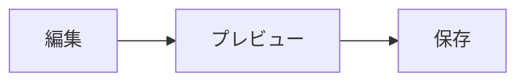

# GFM / Mermaid サンプル

## GFM 基本

| 列 A | 列 B |
| ---- | ---- |
| 1    | 2    |

- [x] 完了タスク
- [ ] 未完了タスク

~~打ち消し線~~

## アラート

> [!NOTE]
> 補足メモです。

> [!WARNING]
> 注意が必要です。

## 脚注

本文に脚注があります[^1]。

[^1]: 脚注の本文です。

## Mermaid



## コード（sugar-high）

```rust
fn main() {
    println!("hello");
}
```
